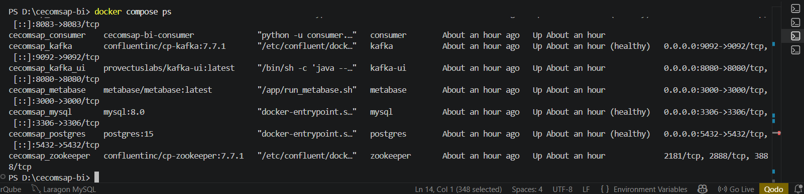

# Arquitectura BI Implementada

## 5. Arquitectura BI Implementada

La arquitectura sigue el patrón **ELT** con separación física real entre la base transaccional y la base analítica en contenedores Docker independientes. El CDC con Debezium elimina el polling y captura cada cambio en tiempo real.

```
BD MARZO26.xlsx → loader.py → MySQL OLTP (oltp_cecomsap)
    → Debezium CDC → Kafka
    → consumer.py → PostgreSQL raw (Bronze)
    → dbt staging (Silver)
    → dbt marts (Gold)
    → Power BI
```



---

## Componentes del Pipeline

| Componente | Estado | Evidencia en el repo |
|---|---|---|
| MySQL OLTP — tabla cartera (50 cols, 737 filas) | Completo | `2_mysql/01_create_oltp_table.sql` |
| Loader Excel → MySQL | Completo | `1_data/load_to_mysql.py` |
| Debezium conector CDC | Completo | `3_debezium/connector-config.json` |
| Kafka broker + topic | Completo | `docker-compose.yml` (cp-kafka:7.7.1) |
| Consumer Python → raw.cartera | Completo | `4_consumer/consumer.py` |
| PostgreSQL raw (Bronze) | Completo | `5_postgres/02_create_raw_table.sql` |
| dbt staging (Silver) — stg_cartera | Completo | `6_dbt/models/staging/stg_cartera.sql` |
| dbt marts (Gold) — 5 dims + fact_cartera | Completo | `6_dbt/models/marts/` |
| Power BI — modelo + 6 KPIs + dashboard | Completo | `8_powerbi/medidas_dax.md` |

---

## Herramientas Utilizadas

| Componente | Herramienta / Tecnología | Evidencia |
|---|---|---|
| OLTP | MySQL 8.0 (Docker) | Contenedor cecomsap_mysql, puerto 3306 |
| Ingesta CDC | Debezium 2.7 + Kafka Confluent 7.7 | Conector MySQL binlog → topic Kafka |
| Consumer | Python 3 (consumer.py) | Kafka → raw.cartera en PostgreSQL |
| Data Warehouse | PostgreSQL 15 (Docker) | Contenedor cecomsap_postgres, puerto 5432 |
| Transformación | dbt Core + dbt-postgres | 7 modelos: stg_cartera + 5 dims + fact_cartera |
| Dashboard | Power BI Desktop | cecomsap_cartera.pbix |
| Documentación | MkDocs + GitHub Actions | Sitio publicado automáticamente en cada push |

---

## Por qué Debezium en lugar de Airbyte

Debezium captura cambios en tiempo real via binlog de MySQL **sin polling**. Es más eficiente para una cartera activa donde cada pago o actualización de estado debe reflejarse inmediatamente.

> **Valor del producto:** CDC en tiempo real — Debezium captura cada INSERT o UPDATE de MySQL via binlog y lo entrega a Kafka en milisegundos. La columna `_cdc_ts` en `raw.cartera` registra el timestamp exacto de cada cambio.
