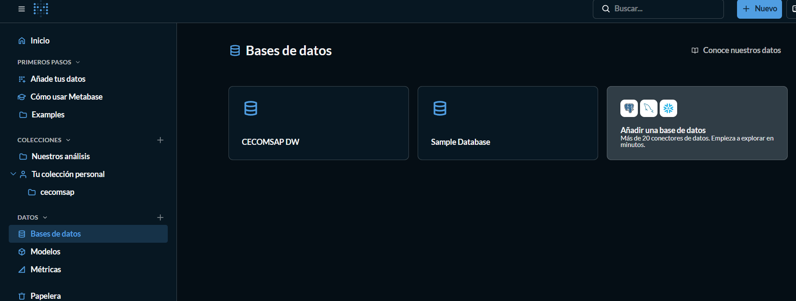
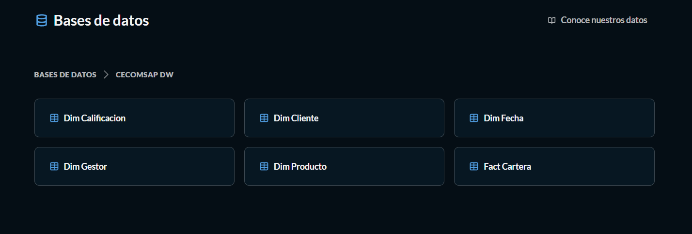
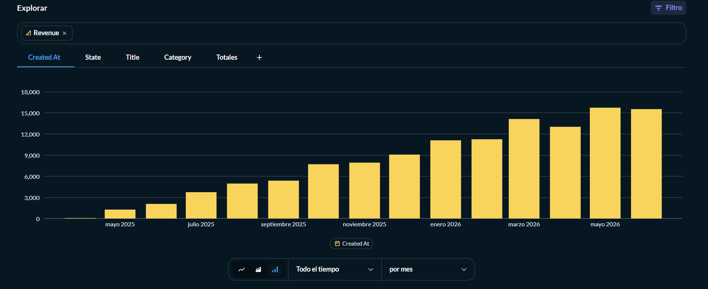
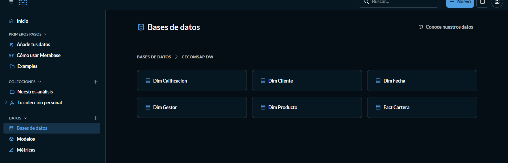

# Modelo Semántico y Dashboard

## 9. Modelo Semántico en Power BI

### PASO 9 — Conectar Power BI al Data Warehouse

```
Servidor:  127.0.0.1:5432
Base:      dw_cecomsap
Usuario:   dw_user
Password:  dw_pass123
Modo:      Import
```



---

### PASO 10 — Importar las 6 tablas del esquema marts

En el navegador seleccionar solo el esquema marts. Importar: `fact_cartera`, `dim_fecha`, `dim_producto`, `dim_cliente`, `dim_gestor` y `dim_calificacion`.



---

## 9.1 Relaciones del Modelo

| Dimensión → Hecho | Campo dimensión | Campo fact_cartera | Tipo |
|---|---|---|---|
| dim_fecha → fact_cartera | date_id | date_id_desembolso | 1:* activa |
| dim_fecha → fact_cartera | date_id | date_id_ultimo_pago | 1:* inactiva (USERELATIONSHIP) |
| dim_producto → fact_cartera | product_id | product_id | 1:* activa |
| dim_cliente → fact_cartera | customer_id | customer_id | 1:* activa |
| dim_gestor → fact_cartera | gestor_id | gestor_id | 1:* activa |
| dim_calificacion → fact_cartera | calif_id | calif_id | 1:* activa |

---

## 9.2 Medidas DAX — Los 6 KPIs

```dax
-- KPI 1: Saldo Vigente Total
Saldo Vigente Total = SUM(fact_cartera[saldo_credito])

-- KPI 2: Capital en Mora
Capital en Mora = SUM(fact_cartera[capital_atraso])

-- KPI 3: Índice de Morosidad %
Índice de Morosidad % = DIVIDE(
    SUM(fact_cartera[capital_atraso]),
    SUM(fact_cartera[saldo_credito]),
    0
) * 100

-- KPI 4: Provisión Total
Provisión Total = SUM(fact_cartera[provision_cartera])

-- KPI 5: Cobertura de Provisión %
Cobertura Provisión % = DIVIDE([Provisión Total], [Capital en Mora], 0) * 100

-- KPI 6: % Cartera en Riesgo
% Cartera en Riesgo = DIVIDE(
    CALCULATE(
        SUM(fact_cartera[saldo_credito]),
        dim_calificacion[calificacion] IN {"PER","DUD","DEF","POT"}
    ),
    SUM(fact_cartera[saldo_credito]),
    0
) * 100
```

### Criterios de Interpretación (Semáforo)

| KPI | 🔴 Riesgo | 🟡 Alerta | 🟢 Saludable |
|---|---|---|---|
| Índice de Morosidad % | > 8% | 5% – 8% | < 5% |
| Cobertura de Provisión % | < 80% | 80% – 100% | > 100% |
| % Cartera en Riesgo | > 15% | 8% – 15% | < 8% |

---

## 9.3 Medidas de Comparativo Temporal (Criterio 7 Rúbrica)

```dax
-- Comparativo vs año anterior
Saldo Año Anterior = CALCULATE(
    [Saldo Vigente Total],
    SAMEPERIODLASTYEAR(dim_fecha[full_date])
)

Variación Saldo % = DIVIDE(
    [Saldo Vigente Total] - [Saldo Año Anterior],
    [Saldo Año Anterior], 0
) * 100

-- Comparativo vs mes anterior
Mora Mes Anterior = CALCULATE(
    [Capital en Mora],
    DATEADD(dim_fecha[full_date], -1, MONTH)
)

% Variación Mora Mensual = DIVIDE(
    [Capital en Mora] - [Mora Mes Anterior],
    [Mora Mes Anterior], 0
) * 100
```



---

## 10. Dashboard Interactivo

### 10.1 Páginas del Dashboard

| Página | Objetivo | Visuales principales |
|---|---|---|
| Cartera General | Resumen ejecutivo de los 6 KPIs | 4 tarjetas KPI + barras por calificación SBS + tabla por tipo de crédito |
| Morosidad | Análisis de mora y atraso | Barras por bucket_atraso + ranking de gestores + días atraso promedio |
| Comparativo | Variación temporal (obligatorio) | Línea saldo año vs año + tarjetas % variación mensual + tabla KPI por gestor |

### 10.2 Comparativos Obligatorios (Criterio 7 Rúbrica)

| Actividad obligatoria | Dónde está en el dashboard |
|---|---|
| Comparativo vs mismo periodo del año anterior | Página Comparativo: línea Saldo Vigente 2025 vs 2026 por mes (SAMEPERIODLASTYEAR) |
| Comparativo vs periodo anterior | Página Comparativo: tarjeta % Variación Mora Mensual (DATEADD -1 MONTH) |
| Tabla KPI de variación por dimensión de negocio | Página Comparativo: tabla con Capital en Mora y % Variación por gestor |

### Dashboard — Vista de Fact Cartera



---

## 14. Hallazgos, Interpretación y Decisión Recomendada

| Hallazgo | Evidencia | Interpretación | Decisión recomendada |
|---|---|---|---|
| Índice de morosidad supera el umbral de alerta | Tarjeta Índice Morosidad % en rojo (> 8%) | La cooperativa está en zona de alerta según normativa SBS | Activar plan de cobranza intensiva inmediata |
| Mayor concentración de mora en bucket > 30 días | Barra bucket_atraso: 31-60 y >90 días dominan | El atraso corto (1-30 días) ya migró a atraso severo | Priorizar cobranza en 31-60 días antes de que pasen a PER |
| Calificación PER concentra alto % del saldo en riesgo | Barras por calificación SBS — PER visible | Alta exposición a pérdida directa e incobrabilidad | Revisar y reforzar provisiones SBS en créditos PER |
| Gestores con mora heterogénea | Tabla ranking por gestor — variación visible | Algunos gestores duplican el índice promedio del equipo | Redistribuir cartera de alto riesgo y capacitar gestores rezagados |

### Decisión Final Propuesta

1. **Activar un plan de cobranza intensiva** en los créditos del bucket 31-60 días para evitar que migren a calificación DUD o PER
2. **Reforzar las provisiones** de los créditos calificados como PER dado su alto peso en el capital en riesgo
3. **Implementar seguimiento semanal** del dashboard para que la jefatura detecte gestores con mora creciente antes de que supere el umbral de alerta (8%)
