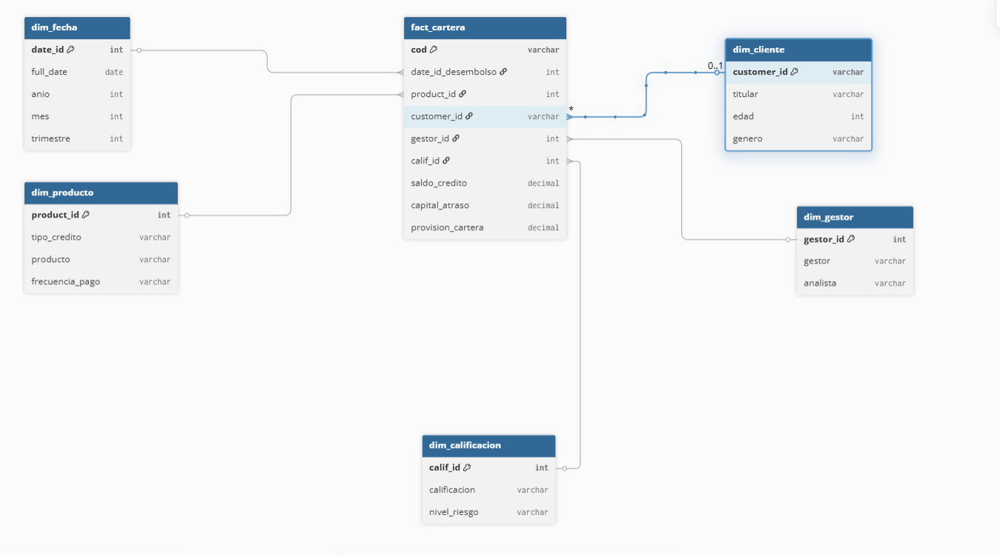
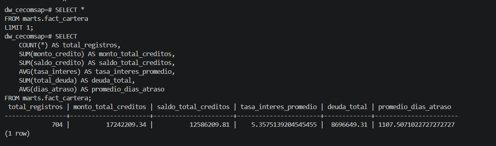

# DataMart y Modelo Dimensional

## 8. DataMart y Modelo Dimensional

El DataMart implementa un **Esquema Estrella** con una tabla de hechos central y cinco dimensiones.  
El grano es: **un crédito por fila, al corte del 31/03/2026**.



---

## 8.1 Tabla de Hechos: `fact_cartera`

| Grupo | Campos | Fuente en los 6 KPIs |
|---|---|---|
| Claves FK | product_id, gestor_id, calif_id, date_id_desembolso, date_id_ultimo_pago | Filtros dimensionales |
| Clave natural | cod (código del crédito) | Grano único |
| Métricas financieras | monto_credito, saldo_credito, capital_atraso, mora, provision_cartera | KPIs 1, 2, 4 directamente |
| KPIs precalculados | tasa_morosidad_pct = capital_atraso/saldo_credito*100 | KPI 3 — Índice de Morosidad % |
| Mora detallada | dias_atraso, cuotas_atraso, bucket_atraso, capital_vencido, interes_vencido | Análisis de atraso |
| Metadata CDC | fecha_corte, cdc_operacion, cdc_timestamp | Trazabilidad del dato |

---

## 8.2 Dimensiones

| Dimensión | Clave | Atributos principales |
|---|---|---|
| dim_fecha | date_id | full_date, dia, mes, nombre_mes, trimestre, anio, es_fin_semana — fuente del comparativo temporal |
| dim_producto | product_id | tipo_credito, producto, frecuencia_pago, descripcion_tipo, familia_producto |
| dim_cliente | customer_id | titular, edad, rango_etario, genero, tipo_vivienda, region, es_rural |
| dim_gestor | gestor_id | gestor, gestor_origen, analista, es_gestor_original |
| dim_calificacion | calif_id | calificacion (NOR/POT/DEF/DUD/PER), descripcion, nivel_riesgo, orden_riesgo, tasa_provision_referencial |

---

## 8.3 Reglas de Negocio Aplicadas en dbt

| Regla | Modelo dbt | KPI afectado |
|---|---|---|
| COALESCE de nulos numéricos a 0 | stg_cartera.sql | KPIs 1, 2, 4 (sin nulos en sumas) |
| bucket_atraso: Al día / 1-30 / 31-60 / 61-90 / >90 días | stg_cartera.sql | Análisis de mora por tramo |
| tasa_morosidad_pct = capital_atraso / saldo_credito * 100 | fact_cartera.sql | KPI 3 — Índice de Morosidad % |
| calificacion = UPPER(TRIM(calif)) — default NOR si nulo | stg_cartera.sql | KPI 6 — % Cartera en Riesgo |
| Grano único por cod (unique_key en dbt incremental) | fact_cartera.sql | Todos los KPIs |

---

## Consulta SQL sobre `marts.fact_cartera`

```sql
SELECT
    COUNT(*)                                    AS total_registros,
    SUM(monto_credito)                          AS monto_total_creditos,
    SUM(saldo_credito)                          AS saldo_total_creditos,
    AVG(tasa_interes)                           AS tasa_interes_promedio,
    SUM(total_deuda)                            AS deuda_total,
    AVG(dias_atraso)                            AS promedio_dias_atraso
FROM marts.fact_cartera;
-- Resultado: 704 registros | saldo_total: 12,586,209.81
```



---

## Por qué Esquema Estrella

El proceso de negocio es uno solo (cartera de créditos) y todas las preguntas convergen en las mismas métricas financieras. Una sola tabla de hechos con 5 dimensiones es:

- **Suficiente** para responder las 6 preguntas de negocio
- **Eficiente** en Power BI modo Import
- **Fácil de mantener** con actualizaciones CDC en tiempo real

---

## 13. Calidad de Datos y Gobierno Mínimo

### 13.1 Controles Aplicados (dbt test)

| Control | Prueba dbt | Columna / Regla | Resultado |
|---|---|---|---|
| Completitud | not_null | stg_cartera.cod — sin nulos en clave primaria | PASS |
| Completitud | not_null | stg_cartera.monto_credito — sin nulos en monto | PASS |
| Completitud | not_null | stg_cartera.saldo_credito — sin nulos en saldo | PASS |
| Unicidad | unique | stg_cartera.cod — sin créditos duplicados | PASS |
| Valores válidos | accepted_values | calificacion IN (NOR, POT, DEF, DUD, PER) | PASS |
| Valores válidos | accepted_values | tipo_credito IN (MIE, CON, PEE, MEE) | PASS |
| Rango válido | expression_is_true | monto_credito > 0 | PASS |
| Rango válido | expression_is_true | dias_atraso >= 0 | PASS |

### 13.2 Gobierno del Dato

| Elemento | Definición | Responsable |
|---|---|---|
| Fuente oficial de KPIs | marts.fact_cartera — única fuente de verdad para todos los KPIs | Equipo BI |
| Definición de KPI | Fórmula única por KPI en la matriz de trazabilidad (sección 12) | Equipo BI |
| Criterio de calidad | Sin nulos en cod, saldo, monto; sin duplicados de cod | Equipo BI |
| Corte de análisis | 31 de marzo de 2026 — campo fecha_corte en fact_cartera | Equipo BI |
| Actualización | Debezium CDC en tiempo real + dbt run bajo demanda | Encargado DataMart |
