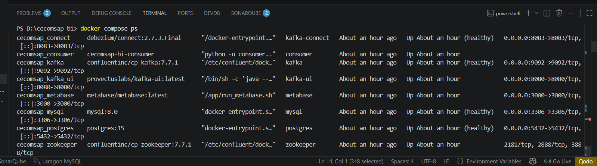
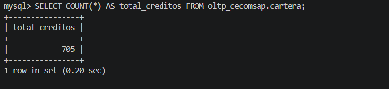
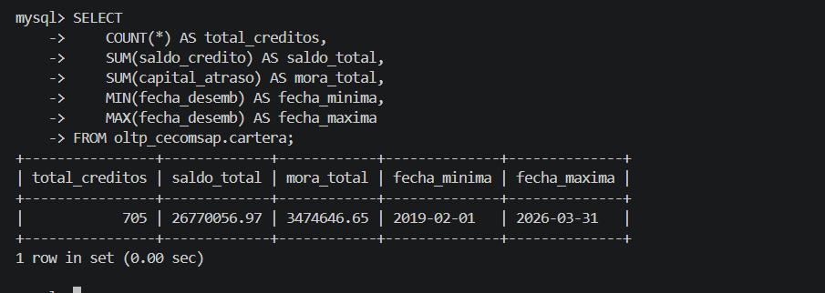
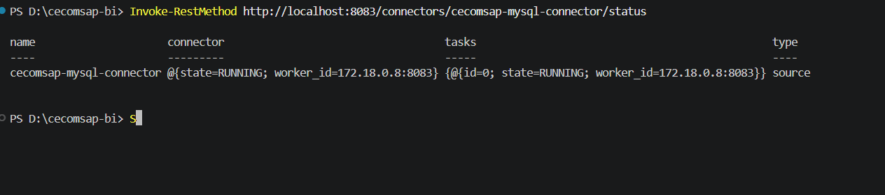
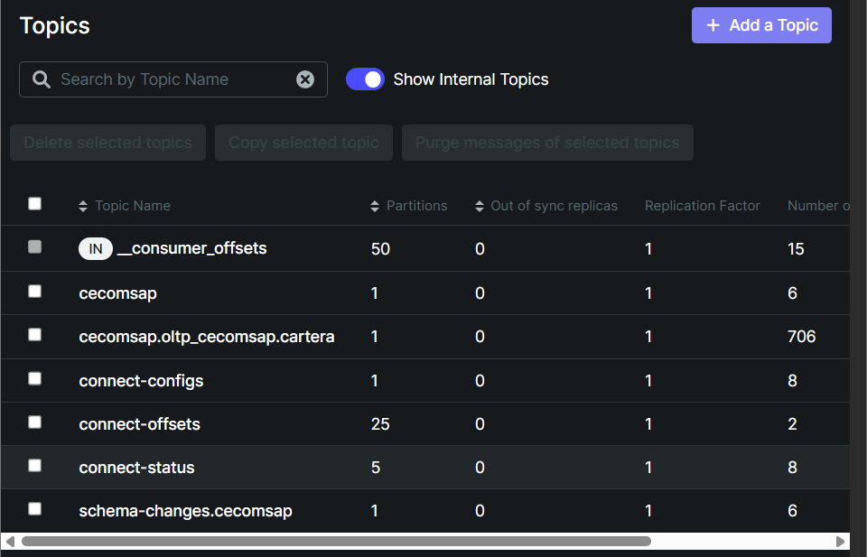
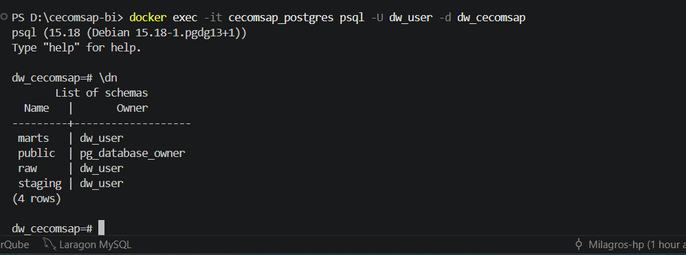
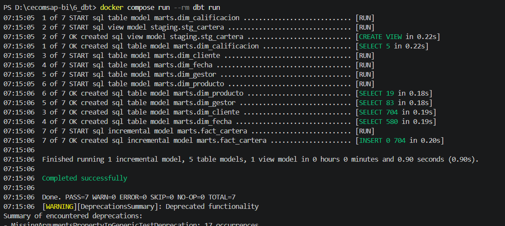
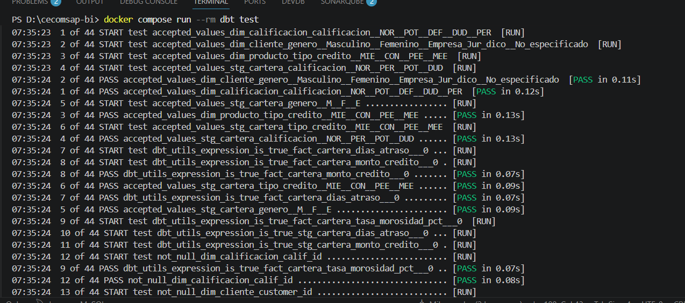
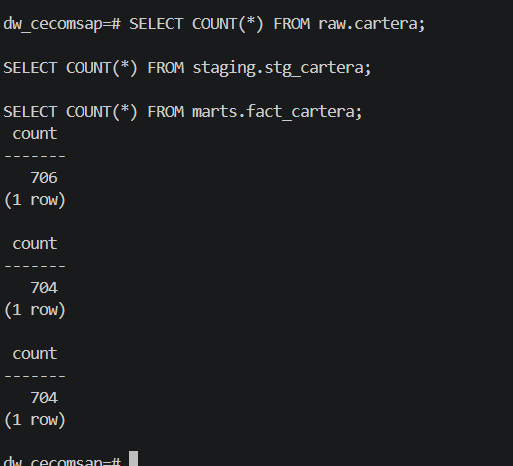

# Pipeline de Ingesta y Transformación

## 6. Fuente Transaccional OLTP

### Tabla `cartera` — Campos Principales

| Grupo | Campos en MySQL | Uso analítico |
|---|---|---|
| Identificación | cod (PK), titular, di | Clave del crédito y del socio |
| Tipo de crédito | tcr (MIE/CON/PEE/MEE), prod, codigo_credito | Clasificación y familia de producto |
| Condiciones | monto_credito, plazo, frec, tasa, od | Base del KPI Saldo Vigente y Tasa |
| Estado de deuda | saldo_credito, capital_atraso, mora, provision | Fuente de los 6 KPIs principales |
| Atraso | cuot_atrs, dias_atrs, cap_venc, int_vnc | Bucket de atraso y mora |
| Calificación SBS | calif (NOR/POT/DEF/DUD/PER) | % Cartera en Riesgo |
| Gestión | gestor, analista, promotor | Ranking de mora por gestor |
| CDC | _cdc_ts | Timestamp para captura incremental Debezium |

---

## Evidencia del Origen — Paso a Paso

### PASO 1 — Levantar el stack Docker

```bash
docker compose up -d
docker compose ps
# Resultado esperado: cecomsap_mysql, cecomsap_zookeeper,
# cecomsap_kafka, cecomsap_connect, cecomsap_postgres — todos Up
```



---

### PASO 2 — Cargar el Excel a MySQL

El `loader.py` lee `BD_MARZO26.xlsx` e inserta los 737 créditos en la tabla cartera.

```bash
docker compose --profile load run --rm loader
# Output: 737 filas insertadas en oltp_cecomsap.cartera
```



---

### PASO 3 — Verificar los datos en MySQL

Conectarse con DBeaver (localhost:3306, user: root, pass: root1234) y ejecutar:

```sql
SELECT
    COUNT(*)                     AS total_creditos,
    ROUND(SUM(saldo_credito), 2) AS saldo_total,
    ROUND(SUM(capital_atraso),2) AS mora_total,
    ROUND(SUM(provision),     2) AS provision_total
FROM oltp_cecomsap.cartera;
-- Resultado esperado: 737 filas con los totales financieros reales
```



---

## 7. Pipeline de Ingesta y Transformación

### 7.1 Ingesta CDC con Debezium + Kafka

#### PASO 4 — Registrar el conector Debezium

```bash
curl -X POST http://localhost:8083/connectors \
  -H "Content-Type: application/json" \
  -d @3_debezium/connector-config.json
# Verificar estado:
curl http://localhost:8083/connectors/cecomsap-mysql-connector/status
```



---

#### PASO 5 — Iniciar el Consumer → datos en `raw.cartera`

```bash
docker compose up -d consumer
# Verificar en PostgreSQL (localhost:5432, user: dw_user, pass: dw_pass123):
SELECT COUNT(*) FROM raw.cartera;   -- Esperado: 737
```



> **Figura 6.** Kafka UI mostrando el topic `cecomsap.oltp_cecomsap.cartera` con 706 mensajes, confirmando que Debezium está capturando los cambios de la tabla cartera y publicándolos correctamente en Kafka.

---

### 7.2 Transformación con dbt

#### PASO 6 — Ejecutar `dbt run` → staging y marts

dbt transforma `raw.cartera` en `stg_cartera` (limpieza) y luego en el modelo dimensional (5 dims + fact_cartera).

```bash
docker compose --profile dbt run --rm dbt run
# Output esperado — 7 modelos OK:
# stg_cartera, dim_fecha, dim_producto, dim_cliente,
# dim_gestor, dim_calificacion, fact_cartera
```





---

#### PASO 7 — Ejecutar `dbt test` → calidad automática

dbt test verifica: `not_null` en cod, `unique` en cod, `accepted_values` en calificacion (NOR/POT/DEF/DUD/PER) y en tipo_credito (MIE/CON/PEE/MEE), y `expression_is_true` para monto_credito > 0.

```bash
docker compose --profile dbt run --rm dbt test
# Output esperado: N of N PASS — sin ningún FAIL
```



---

#### PASO 8 — Verificar las tres capas en PostgreSQL

```sql
-- Bronze (réplica exacta):
SELECT COUNT(*) FROM raw.cartera;              -- 737
-- Silver (limpieza dbt):
SELECT COUNT(*) FROM staging.stg_cartera;      -- 704
-- Gold (modelo dimensional):
SELECT COUNT(*) FROM marts.fact_cartera;       -- 704
```



> La tabla `raw.cartera` contiene **737 registros** cargados desde la fuente, mientras que `staging.stg_cartera` y `marts.fact_cartera` contienen **704 registros** después de aplicar las reglas de transformación y calidad de datos.

---

## Hallazgos de Validación del Pipeline

| Hallazgo | Causa | Ajuste aplicado | Estado |
|---|---|---|---|
| Cluster Kafka con cluster.id inválido al reiniciar Docker | Zookeeper con volumen persistente cachea el ID entre reinicios | Eliminar volumen de zookeeper en docker-compose → arranque limpio siempre | Resuelto |
| Consumer ignoraba mensajes con operación 'd' (delete) y fallaba | Debezium incluye mensajes de delete con value = null | consumer.py filtra operaciones distintas de 'd' antes de insertar | Resuelto |
