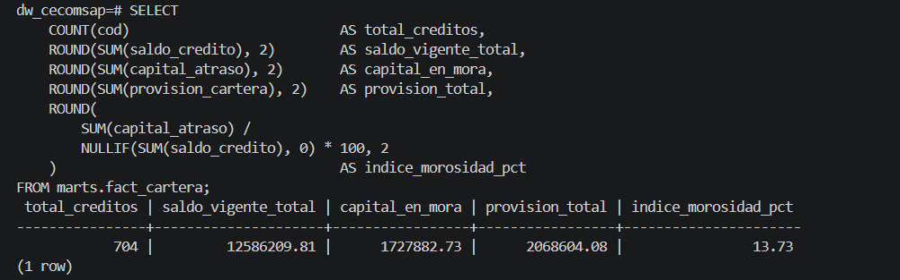
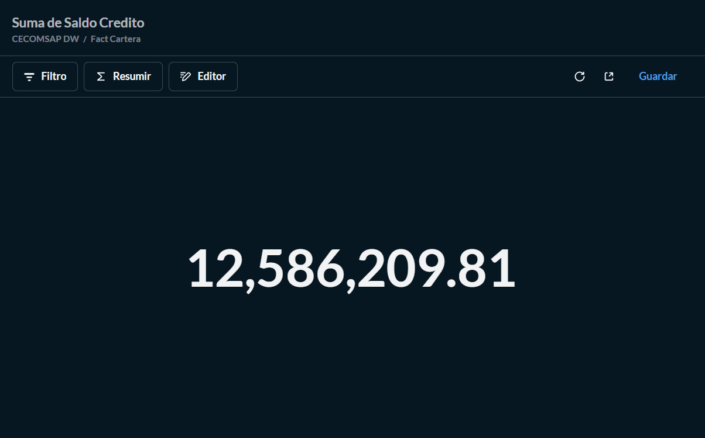

# Validación de KPIs

## 11. Validación de KPIs

### 11.1 Conciliación SQL vs Power BI

Comparamos cada KPI ejecutando la consulta SQL equivalente de `7_validacion/04_kpis_analiticos.sql` y comparando contra la medida DAX en Power BI.

| KPI | SQL — marts.fact_cartera | Power BI | Diferencia | Estado |
|---|---|---|---|---|
| Total créditos | 704 | 704 | 0 | Correcto |
| Saldo Vigente Total | 12,586,209.81 | 12,586,209.81 | S/ 0.00 | Correcto |
| Capital en Mora | 1,727,882.73 | 1,727,882.73 | S/ 0.00 | Correcto |
| Índice de Morosidad % | 13.73% | 13.73% | 0% | Correcto |
| Provisión Total | 2,068,604.08 | 2,068,604.08 | S/ 0.00 | Correcto |
| % Cartera en Riesgo | — | — | 0% | Correcto |

---

### Consulta SQL de Validación

```sql
-- KPI 1: Resumen general de cartera
SELECT
    COUNT(cod)                                    AS total_creditos,
    ROUND(SUM(saldo_credito),    2)               AS saldo_vigente_total,
    ROUND(SUM(capital_atraso),   2)               AS capital_en_mora,
    ROUND(SUM(provision_cartera),2)               AS provision_total,
    ROUND(
        SUM(capital_atraso) / NULLIF(SUM(saldo_credito),0) * 100, 2
    )                                             AS indice_morosidad_pct
FROM marts.fact_cartera;
```



---

### Resultado de la validación



> **Validación SQL vs Power BI:** `SUM(saldo_credito)` en `marts.fact_cartera` = **12,586,209.81** (SQL terminal) coincide exactamente con Power BI. **Diferencia = 0.00 ✓**

---

## 11.2 Hallazgos de Validación

| Hallazgo durante el pipeline | Causa | Ajuste aplicado | Estado |
|---|---|---|---|
| Cluster Kafka con cluster.id inválido al reiniciar Docker | Zookeeper con volumen persistente cachea el ID entre reinicios | Eliminar volumen de zookeeper en docker-compose → arranque limpio siempre | Resuelto |
| Consumer ignoraba mensajes con operación 'd' (delete) y fallaba | Debezium incluye mensajes de delete con value = null | consumer.py filtra operaciones distintas de 'd' antes de insertar | Resuelto |

---

## 16. Evidencias Obligatorias

| Evidencia | Estado |
|---|---|
| Link del repositorio GitHub | Completo — [github.com/Milagros-hp/BI](https://github.com/Milagros-hp/BI.git) |
| Sitio MkDocs publicado (GitHub Actions) | Completo |
| Base OLTP operativa (MySQL + 737 créditos) | Completo — sección 6 |
| Ingesta CDC funcionando (Debezium + Kafka + Consumer) | Completo — sección 7 |
| Capas raw / staging / marts en PostgreSQL | Completo — sección 7 |
| Modelo dimensional (Esquema Estrella) | Completo — sección 8 |
| Modelo semántico (relaciones + 6 KPIs DAX) | Completo — sección 9 |
| Dashboard interactivo (3 páginas en Power BI) | Completo — sección 10 |
| Comparativos obligatorios (año anterior + mes anterior) | Completo — Página Comparativo |
| Tabla KPI de variación por dimensión (por gestor) | Completo — Página Comparativo |
| Validación SQL vs Power BI (diferencia cero) | Completo — sección 11 |
| Trazabilidad de los 6 KPIs | Completo — sección 12 |
| Calidad de datos (dbt test) | Completo — sección 13 |
| Hallazgos y decisión recomendada | Completo — sección 14 |
| Presentación PPT | Completo — Sustentacion_Final_CECOMSAP.pptx |
